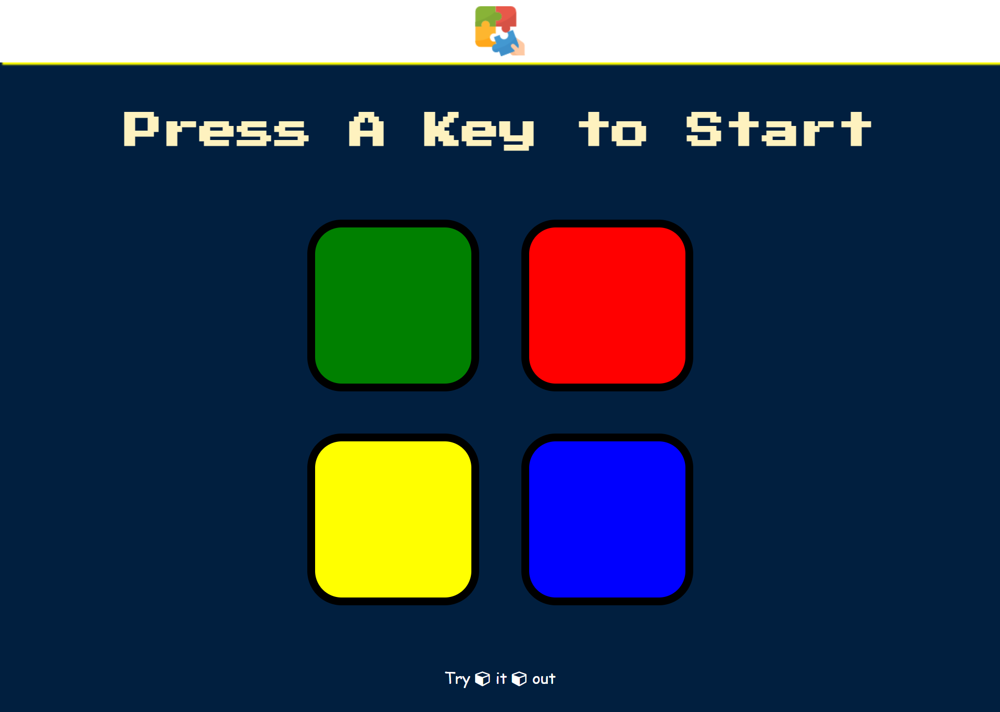

# Simon Game
Simon is a memory game. It is based on the simple children’s game “Simon says”. The game creates a series of tones and patterns and requires a user to repeat the sequence. If the user succeeds, the series becomes progressively longer and more complex. Once the user fails or the time limit runs out, the <b>game</b> is <b>over.</b>

